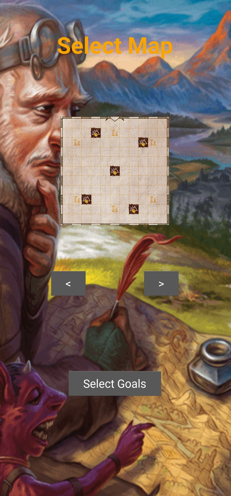
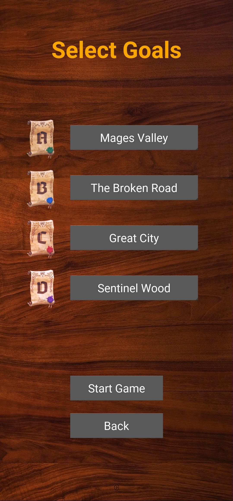
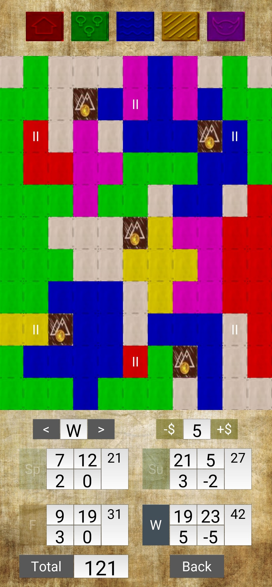

Cartographers' Companion App (CaCo)
=================

A companion app for marking a map and counting scores in the game Cartographers. This app is intended to be used alongside a physical copy of the game.

CaCo is fanmade and is in no way associated with Thunderworks Games

Screenshots
-----------

Libraries Used
--------------
* [Kivy][0] - Open source Python library for rapid development of applications

[0]: https://kivy.org/#home

Useful Tutorials
--------------------
* [GeekForGeeks - Kivy Series][0] - Tutorials on the different kivy widgets and example uses
* [LeetCode][1] - Step-by-step solutions for certain goal computations, such as island finding with DFS and largest maximal square with DP
* [towards data science][2] - Instructions for how to build android apk from python files using buildozer

[0]: https://www.geeksforgeeks.org/kivy-tutorial/
[1]: https://leetcode.com/
[2]: https://towardsdatascience.com/3-ways-to-convert-python-app-into-apk-77f4c9cd55af
